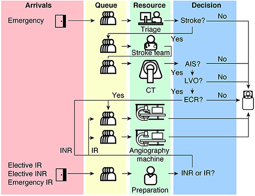

# Reproduction README

## Model summary

> Huang S, Maingard J, Kok HK, Barras CD, Thijs V, Chandra RV, Brooks DM and Asadi H. **Optimizing Resources for Endovascular Clot Retrieval for Acute Ischemic Stroke, a Discrete Event Simulation**. *Frontiers in Neurology* 10, 653 (2019). <https://doi.org/10.3389/fneur.2019.00653>.

This is a discrete-event simulation model of an endovascular clot retrieval (ECR) service. ECR is a treatment for acute ischaemic stroke. The model includes the stroke pathway, as well as three other pathways that share resources with the stroke pathway: an elective non-stroke interventional neuroradiology pathway, an emergency interventional radiology pathway, and an elective interventional radiology pathway.

The model is created using R Simmer.

The paper explores waiting times and resource utilisation - particularly focussing on the biplane angiographic suite (angioINR). A few scenarios are tried to help examine why the wait times are so high for the angioINR.

Model structure from Huang et al. 2019:



## Scope of the reproduction

In this assessment, we attempted to reproduce 8 items: 5 figures and 3 in-text results. 

## Reproducing these results

### Repository overview

```
├── docker
│   └──  ...
├── outputs
│   └──  ...
├── renv
│   └──  ...
├── scripts
│   └──  ...
├── tests
│   └──  ...
├── .Rprofile
├── DESCRIPTION
├── README.md
├── reproduction.Rproj
└── renv.lock
```

* `docker/` - Instructions for creation of docker container.
* `outputs/` - Outputs files from the scripts (e.g. `.csv.gz`, `.png`)
* `renv/` - Instructions for creation of R environment
* `scripts/` - Code for the model and for reproducing items from the scope
* `tests/` - Test to check that the model produces consistent results with our reproduction
* `.Rprofile` - Activates R environment
* `DESCRIPTION` - Lists packages that we installed into environment (their dependencies will have also been installed)
* `README.md` - This file!
* `huang2019.Rproj` - Project settings, which specify the Python virtual environment to use when building pages from the Quarto site that include Python. If you choose to build the Quarto site (and not just run the reproduction files in this folder), you will want to update this to a path on your machine (which you can do easily by opening this file in RStudio)
* `renv.lock` - Lists R version and all packages in the R environment

### Memory usage

**Note:** We have found this model to have high memory usage. When running in RStudio, we found it was using about 8GB RAM. Hence, will require a machine with sufficient memory (e.g. we weren't able to run on virtual machine as that only allocates 4GB RAM).

### Step 1. Set up environment

Before you can run the model, you will need to create an R environment with the correct version of R and the specified packages.

#### Option A. Renv

An `renv` environment has been provided. To create this environment locally on your machine, you should open the R project with the R environment loaded, and then run:

```
renv::restore()
```

In `renv.lock`, you will see the version of R listed. However, `renv` will not install this for you, so you will need to switch to this yourself if you wish to also use the same version of R. This reproduction has been run in R 4.4.1, and it is possible (although not definite) that later versions of R may not be compatible, or that you may encounter difficulties installing the specified package versions in later versions of R.

#### Option B. Build local docker image

A Dockerfile is provided, which you can use to build the Docker image. The docker image will include the correct version of R, the required packages and their versions, and an installation of RStudio which you can run from your browser. It will also include the scripts and outputs from this directory. For this option and option C, you'll need to ensure that `docker` is installed on your machine.

To create the docker image and then open up RStudio:

1. In the terminal, navigate to the parent directory of your `reproduction/` folder
2. Build the image:

```
docker build --tag huang2019 . -f ./reproduction/docker/Dockerfile
```

3. Create container and open RStudio:

```
(sleep 2 && xdg-open http://localhost:8888) & sudo docker run -it -p 8888:8787 -e DISABLE_AUTH=true --name huang2019_docker huang2019
```

#### Option C. Pull pre-built docker image

A pre-built image is available on the GitHub container registry. To use it:

1. Create a Personal Access Token (Classic) for your GitHub account with `write:packages` and `delete:packages` access
2. On terminal, run the following command and then enter your sudo password (if prompted), followed by the token just generated (which acts as your GitHub password)

```
sudo docker login ghcr.io -u githubusername
```

3. Download the image:

```
sudo docker pull ghcr.io/pythonhealthdatascience/huang2019
```

4. Create container and open RStudio:

```
(sleep 2 && xdg-open http://localhost:8888) & sudo docker run -it -p 8888:8787 -e DISABLE_AUTH=true --name huang2019_docker ghcr.io/pythonhealthdatascience/huang2019:latest
```

### Step 2. Running the model

#### Option A: Execute the notebooks

To run all the model scenarios, open and execute the provided `.qmd` files in `scripts/`. You can do so within your preferred IDE (e.g. RStudio).

#### Option B: Testthat

Three of the model scenarios have been included as tests within `tests/testthat`. You can run these tests by running the following command from your R console whilst in the `reproduction/` directory:

```
testthat::test_dir("tests/testthat")
```

This will run the three scenarios, save the results as temporary files, and compare the results against those we have saved. Although this will not produce any figures from the paper, and will not run all the scenarios, it will allow you to check if you are getting results consistent with our reproduction, on your own machine.

As the tests run, you will see the counter increments on your screen (with the column indicating whether the test is successful). For example, if tests are successul, you will see it increment in the "OK" column:

```
✔ | F W  S  OK | Context
⠏ |          0 | model                                               [1] ""
⠋ |          1 | model                                               [1] ""
```

Each test will take about 2 minutes (for the machine specs given below). Once all three tests are complete, the run time and results will display:

```
══ Results ══════════════════════════════════════════════════════════
Duration: 371.9 s

[ FAIL 0 | WARN 0 | SKIP 0 | PASS 3 ]
```

## Reproduction specs and runtime

This reproduction was conducted on an Intel Core i7-12700H with 32GB RAM running Ubuntu 22.04.4 Linux.

On this machine, the reproduction run time was 29 minutes 10 seconds. This was the total time from executing all the `.qmd` files that run the model and attempt to produce the figures/results (18.024 + 6.165 + 4.975 minutes).

The run time for the tests (which only include a few model scenarios) was 6 minutes 12 seconds.

## Citation

To cite the original study, please refer to the reference above. To cite this reproduction, please refer to the CITATION.cff file in the parent folder.

## License

This repository is licensed under the GNU GPL-3.0 license.
